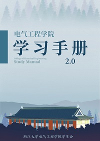

电气工程学院学习手册（下称“手册”）是一本专为电气工程学院各专业本科生编写的**辅助性学习读物**。

手册收录了电路与电子技术（I、II）、电网络分析、工程电磁场与波等**18门课程**的学习资料，涵盖了电气工程及其自动化、电子信息工程两个专业的大部分必修课程，贯穿了大二、大三两个年级，全面阐述了各门课程的知识体系、学习内容、学习方法以及复习方法，在介绍各专业主干课程学习心得的同时，辅以相应的思维导图与学习笔记，为同学们的学习提供一定的参考与借鉴。

**学习手册2.0**在前版基础上新增了DSP原理与应用、电力电子器件及其集成电路等专业课程，并调整了排版，全面阐述了各门课程的课程内容、学习方法以及考核内容，在介绍各专业主干课程学习心得的同时，辅以相应的思维导图与学习笔记，为同学们的学习提供一定的参考与借鉴。有需要的同学请下载附件，祝同学们学习顺利！

学习手册1.0下载链接：[电气工程学院学习手册](http://ee.office.zju.edu.cn/_upload/article/files/2c/aa/bc175be44df7978501bc9e18796d/b84f2522-09b2-41a7-8fe3-60a8614fa0c6-B.pdf)

学习手册2.0下载链接：[电气工程学院学习手册2.0](http://ee.office.zju.edu.cn/_upload/article/files/01/25/a66e66ad41b3bd12a1c7a122c21a/b8135f2a-f27b-4df7-b2c0-65883d9cfa7a.pdf)