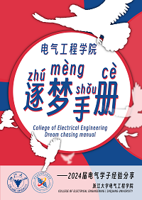

电气工程学院逐梦手册（下称“手册”）是一本专为电气工程学院各专业本科生编写的**生涯规划辅助读物**。手册收录了**考研、保研、出国留学和本科就业**四大本科毕业去向的相关经验和建议。

手册2024版在十一位2021届毕业生的经验基础上，增添十七位2024届毕业生的应届经历。手册涵盖心态、选择、具体流程和心得经验几部分，内容详实全面，信息及时准确；兼具丰富的经验、建议，以及形象生动的图表等信息。既能为高年级同学的毕业选择提供一定的参考和借鉴，也能帮助低年级同学尽早进行生涯规划。

逐梦手册下载链接：[电气工程学院逐梦手册](http://ee.office.zju.edu.cn/_upload/article/files/c8/2f/4591c2a74cb4ac470d55ce703971/5834c790-b3ab-4c70-a970-f76cc68698cf.pdf)