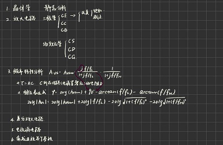
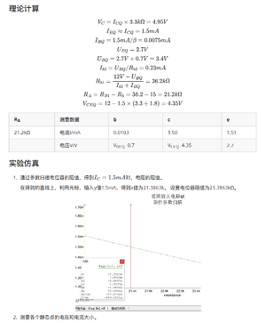
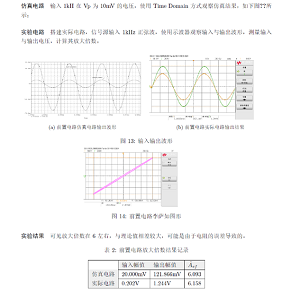

## 22级

=== "Firisy 电子信息工程"

	**E点瞥见，电亮未来**
	
	作为电气工程学院的入门专业基础课程，电路与电子技术以其庞大的体量（6学分+3学分+1.5学分*2的实验课），惊人的难度（模电为电院四大天书之一），让初入电院大门的“新生们”极易望而生怯。然作为电院所有课程开展的基石，不深入学习或（以功利角度表述）在本课程并没有取得满意的成绩，都将为后续的本科学习徒增烦恼，大增难度。虽然课程本身压力较大，然而以更为轻松的视角去深入本门课程并非无迹可寻。本篇将以学习电路与电子技术系列课程（即电路原理、模拟电路、数字电路理论课及其实验课）的路径作为主线，谈谈本人学习这门课程的心路历程以及一些摸索出来的方法与见解。
	
	**一、“万事开头难”，如何开始**
	
	开始，是一个阶段的结束，新阶段的起点。一个阶段的结束，指微积分、大学物理、复变函数这些最为基础的通识课的结束，这些课程为电路与电子技术的开展打下了极为重要的基础。这些课程主要为电路与电子技术提供了以下工具：
	
	1. 微分与积分的数学工具（微积分）；
	2. 电学的基本知识：电压、电流的基本概念（大学物理）；
	3. 复数的计算，从时域变换到复频域角度的思考方式（复变函数）；
	
	掌握以上三点基本的内容，就可以信心满满的正式进入电路与电子技术的学习。课程中所运用到的数学工具并不会过于复杂，然而可能会由于不够熟练而感到困惑。这时候及时复习过往课程的笔记就显得非常重要。我个人利用GoodNotes这一软件进行电子的手写笔记；将多门课程笔记以电子的方式存储一方面是便携、不易丢；另一方面，在课程上对过往内容联想时，非常便于及时查看；还有一方面，可以在每个知识点周围进行大量留白，也不会感到环保角度对纸张浪费的可惜，笔记是常看常新，留白处为后续记录新思考留下了空白之处；与此同时，其大纲的功能很好地帮助我整理笔记、复习知识点。
	
	
	
	在准备完基础内容后，就进入了正式的电路与电子技术学习课堂。
	
	**二、“功夫在平时”，在课堂中**
	
	
	
	课堂上最高效汲取知识的方式是做好充分的预习准备。虽然课业繁重，挤压着自主学习的时间，但是基本的预习是必要的——大致预测老师课堂会讲的内容，在内心中有一个大纲。这种方式能够帮助自己在课堂上以知识点的方式，获取上课内容，从而一方面避免由于无目听课导致的走神；另一方面即便走神，也可以清晰了解哪一部分是自己并不理解的，在课后及时通过智云课堂、书本、学在浙大上老师的资料进行补充学习，而非从头开始，漫无目的再次听课。
	
	其次，我认为对我学习过程中最有帮助的部分，是整理课堂笔记。如模电部分，有非常多庞杂的电路图，而在课后仔细重新绘制电路图，重新推导电路中的关系，一方面帮助自己消化理解课堂老师所讲，另一方面循序渐进帮助自己记忆相关知识点。在绘制过程中，也时常会发现新的器件、新的线路，而他们有着自己独特的存在意义，可能课堂上一笔带过，但绘制时产生的疑问使自己对其的理解更深一层次。
	
	以下是电路与电子技术中各模块中比较重要的部分。
	
	1. 电路原理：电路图、推导关系式。学习路上会碰到的三次瓶颈：瓶颈一，电路定理的运用，要求对电路定理深刻掌握并灵活运用；瓶颈二，第一次碰到从时域考虑转变为从频域考虑电路，将正弦的电压表达式转变为相量分析；瓶颈三，暂态分析，开始学着解有实际含义的常微分方程，并且理解常微分方程中各项的含义。
	2. 模拟电子技术：电路图，关系式的理解。各类放大电路的区分，负反馈概念的第一次接触，各类非线性器件的熟悉。
	3. 数字电路分析：一些基本的逻辑电路构造。相对来说较为简单，一方面能够对逻辑表达式的进行简化，另一方面学会使用各类数字芯片，即能够较好地完成该门课程的学习。
	
	虽然现在有非常多替代课堂学习的手段，但是听取课堂内容还是极为必要的。作为工科学科，除了从理性上的数学推导去了解电路最基本的性质与原理，还需要逐渐建立对电路、器件的感性认知，而这种认识需要通过“过来人”进行指导。去“感觉”这个电路，具体体现在，如面对复杂电路时，能够抓住其中的关键主导部分；面对复杂的计算式时，能够通过合理简化，从而得到优雅简洁的结果。在老师的课堂上，不仅仅需要去听取考试的知识点；观看老师如何简化这一电路，如何抓住其中的主要矛盾，也为未来自主学习进行了非常好的铺垫。
	
	短则八周，长则十六周的课程需要我们建立一个每一步有过程，阶段性有成果的学习路径。以一节课至下一节课之间的时间，作为自己厘清每个知识点的界限，让自己的学习节奏有一些被排满的吃力感，却避免了事情堆积在一起的窒息感。
	
	**三、“临阵磨刀”，如何考试**
	
	学习的目的绝非考试，但考试也为关键的一环。课程的八周或十六周是面向知识点的汲取过程，而临近考试绝对转变为“面向考试”的复习。电路与电子技术课程的知识点十分明晰，课程最后，老师一般会划清考试范围。针对范围，确定其中的每一个知识点是否掌握，是否根据考试要求有着相对应的熟练程度是复习的第一步。如下图所示为我在考试前列出的关键知识点，复习时按照脉络大概厘清需要掌握哪些知识即可。在课程过程中整理的笔记起到了极大的作用，那时课堂中的所思所想通过笔记再次映现至脑海之中。
	
	
	
	在复习过程中，我会按照单元复习。在复习笔记和知识点后，对课后习题进行练习，随后再巩固知识点。面对有较大计算量的部分，会在课后习题、课件中寻找同类型题目，多次计算，增加熟练度。而老师往往在课堂中会提供一些较难的题目，作为拓宽思维或是视野，相对应的我会将其放在最后复习，其并非提分的关键。
	
	电路电子课程还有一个特点，即没有历年卷可供参考（所谓印刷的历年卷内容并不真实准确）。这时“刷题”提分会变得困难。但知识点本身并没有历年卷可言。我不提倡刷题，也不提倡绞尽脑汁寻找所谓历年卷资源，因为知识点本身需要理解，而不是简单刷题、寻找套路即可获取高分。
	
	“面向考试”的复习，指复习要有关键性，在人脑容量有限的情况下，着重强调对“考试”内容的复习与记忆，而并非“面向考试卷”的复习。仍然强调的是学习的过程性，而并非结果性。
	
	**四、“绝知此事要躬行”，谈谈实验与其报告**
	
	 
	
	电路与电子技术的实验所占学分比重不大，但是内容要求不低。且由于本人加入爱迪生班，教学中更加强调实验的比重。做实验过程本身的反复调试足够磋磨一个人的耐心，课后完成相对应繁杂的实验报告更添烦恼。但还是希望能够在踏实的实践过程中，逐渐培养自己动手的能力，也是将理论转化为实际的能力。
	
	实验报告的确有很多可供参考的学长姐资料，但是在经过一年的课程学习之后，我认为学会自己打公式、推导实验公式，总结自己的结论，调试出自己的程序代码对自我的提升远大于完成实验内容本身。从使用MatLab时畏手畏脚，到能够用各类软件包括Python语言对数据进行处理；从使用Word进行报告编排，到自学LateX减轻排版烦恼；从看器件手册不懂器件参数含义，到能够自主挑选合适的器件。慢慢通过实践摸索进入电气的大门是一方面的改变，而不畏惧任何未知的软件、工具是更大的自我提升。
	
	**五、“人生是旷野”，谈谈心态**
	
	电路与电子技术是专业学习生涯中的第一块险坡，然而爬坡的过程绝非无氧地埋头前冲，而应该保有自己的节奏循序渐进向前进。“循序渐进”是我在学习过程中自视最重要的一个词。它避免了一方面的急于求成，认为知识是可以以冲激函数的形式进行积累；也避免了在学习过程中的懈怠。人生是旷野，但也是有着追求目标的前进。
	
	人生是旷野的另一个视角是“自由”地享受。不要指责自己，不要后悔，反思是必要的但绝不是要自己的意志消沉。我们或许容易有这些想法，微积分我获取了不好的分数，我可能就学不好接下来的理工科课程；我可能因为前一天的娱乐，忽视了这几日的学习；可能由于学生工作，这一周都做不到预留时间预习课程。以上所有生活的错乱与一时的苟且，都将不经意间敲击自己的节奏，然后打乱自己的心态，试图让你跟自己说“我无法学好这一门课程”。但它们与你过度指责自己时的证词无关。微积分可以没考好，但是我懂得积分与微分的含义，能够进行简单的计算，就意味着掌握了电路与电子技术中最基本的分析工具；一时对学习的放松，总能够通过后期的补课、看书弥补。尽情地享受大学生活，尝试鼓起勇气走上讲台询问老师几个感觉愚蠢的问题，在一个夜晚去阅读一本书，也正如尝试通宵玩一个游戏，和朋友们聊天到朝阳初升一样值得自己在“地球在线”这款现实游戏中进行挑战。
	
	大学中，我们或功利或理想、或急切或肆意去追求或清晰或不定的目标，但，愿你忠于自己所热爱的事，愿你找到自己存在的方式，愿你快乐且自由，高尚且坚定。

## 18级

=== "陆琦 电气工程及其自动化1804"

    我大二时上的爱班的电路与电子技术，大二秋是姚缨英老师上的电路原理部分，大二冬是林平老师上的模电部分，大二春夏是林平老师上的数电部分。对这课的整体感受是：大二秋冬的电路与电子技术上课的节奏比较紧凑，相信不少爱班同学都还记得被一周两次模电课支配的恐惧；大二春夏数电部分的上课节奏就比较舒服，一周只用上一次课。 
    
    ​电路原理部分：讲的东西比较浅显易懂，主要是概念比较多比较杂，如果大家有高中物理的电路基础的话，这部分内容接受起来应该比较快。考试的话，解题思路大多比较常规，有部分题可能会涉及一些作业里出现过的技巧，建议大家自己认认真真地做一遍课后习题，有些老师还会布置一些课上的习题，大家考试前都可以刷一刷。 
    
    ​模电部分：难度比电路原理上升了一个等级。建议大家在做作业之前自己先把书上或ppt上的东西推导一下，理解知识点。除了平时好好把作业写了之外，最重要的是自己能看一遍书，归纳好每一章内容提到的模型。 
    
    ​数电部分：这门课由于疫情关系我是在线上上的，当时林平老师的授课方式是让我们课下先自己看一遍中国大学mooc上的网课（相当于预习一遍），课上他会再过一遍知识点。强烈安利一波中国大学mooc上林平老师和其他老师开设的数电网课，这个网课的内容教授得非常清楚！因为数电本身知识点并不多，但是题量比较大，所以考试前我复习数电的策略是，先快速过一遍知识点，然后多做一做课后题。 
    
    ​提示：咱们学院开设的数模电课和信电那边的还是有所不同的，信电那边会讲一些器件的底层原理，所以大家如果打算跨修信电的大三课程，建议先学他们的数模电的教材或ppt，不然上课听起来会比较吃力。 最后，祝大家在电路与电子技术这门课上都能取得满意的成绩！

=== "周泽 电气工程及其自动化1801"

    1.勤画图，比较形象，可以加深记忆和理解，比如模电的各种器件的等效模型。
    
    2.针对考试，多翻课本，弄懂课后习题即可 
    
    3.模电的题目，很多都是实际的应用场景，要弄懂题目涉及的各个器件的作用 
    
    4.找共性，电和磁还是有很多比较像的地方。 
    
    5.模电的基础元器件要学好，各种特性，曲线，这样后面学起来就比较轻松，难点在前期 
    
    6.公式熟记，通过做练习加深印象和理解。 
    
    7.复习做整理时不要照抄课本，按自己的理解编写自己能看懂的教材即可。

=== "王晨旭 自动化1801"

    电路部分基础要打好，基本的计算方法需要熟练掌握，包括回路电流、节点电压定律都要牢固掌握。同时电网络分析中有大量涉及控制理论（laplace）、线性代数（双口网络、网络矩阵方程）、偏微分（分布参数电路）等，需要特别注意知识的融合。这门课也是你们电气工程后面进行电力系统分析的最基础内容，一定要重视。实验的话我就不多说了，multisim、pspice都要比较熟练掌握。

