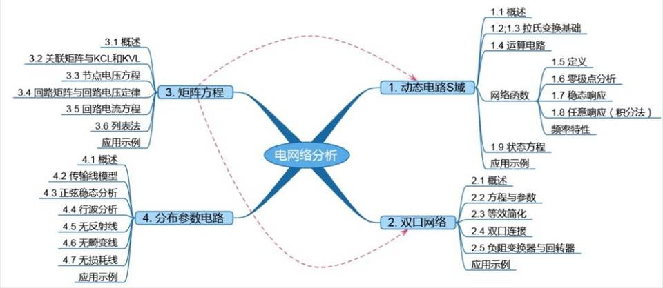

=== "郑欣怡 电气工程及其自动化1803"

	​去年也差不多这个时候，当刚开始学电网络分析的时候，不知道从哪儿看到说，这门课在别的学校都是研究生学的课，一下子就充满惶恐，感觉课好难，我好难。但一步一步踏实学下去，回过头来再看，我想跟学弟学妹分享的是，电网络分析并不是一门很高深晦涩的专业课，不像某些数学课需要很聪明的脑子，它需要的是谦虚、理解。

	​这样讲听着有些玄学，具体展开来说，我所理解的电网络分析的宗旨是：**把部分曾经所学当作“工具”，运用到特定类型的电路中，从而对这些电路进行某种建模、求解并分析。**

	**第一个关键词：“工具”。**

	​这里所说的“曾经所学的课”包括例如线代、拉普拉斯变换、电路原理等。这些课没学好也不用慌，所谓工具的意思就是你知道它是啥、该怎么用，就可以了。等学到快涉及到“工具”相关部分或者刚讲完而你还不太熟悉的时候，再去翻翻以前的笔记/教材就很OK。

	**第二个关键词：“某种建模、求解并分析”。**

	​当你用这个美好的春学期去建造一座名为电网络分析的大楼时，“工具”就好比是砖头，而整个楼的框架就是这门课要教给你的具体方法。要是学歪了，楼也就建歪了。

	​整门课程分为如下图的四个主题，而每个主题相对独立（所以如果你听掉了某次课也别灰心，一定要接着听完）。可以从每章的概述入手，宏观上把握这个章节的问题背景、解决目标，再带着这样的大思路去理解每一步（即每个小节）的实现和意义。听起来很泛，但大家学的时候要记得提醒自己，知道自己正在解决什么问题，这对整个大问题有什么作用，不要被看似复杂的点弄迷茫了。

	

	电网络分析课程内容一览 （图源：姚缨英老师课件）

	接下来再说说我的学习方法，大家各有各的路子，这里写的仅供参考。我习惯上课前做一个很简单的预习，大概知道下节课要学什么，有什么新的名词概念，难点重点在哪里。但不会去看细节，因为想保留学新东西的新鲜感，让自己上课专注。下课后我会花比较多的时间自己整理一遍今日所学，做一份并不是简单照抄老师课件、而是咀嚼理解并按自己思路展开的笔记，把知识点串起来，形成一张关联的网络。需要记忆的地方（这门课还挺多），会定期复习记忆。

	​遇到错题、稍难的题、值得钻研原理的实验，有余力的同学不要放过，静下心来写写算算、与老师同学交流讨论，对于理解电网络分析的一些本质有很大帮助。

	总的来说，电网络分析不难，四个相对独立的章节和学时也决定了每章都不会特别深入而复杂，所以不要畏惧，去谦虚接受它绘给你的框架，理解并运用工具多多练习，一定能够学有所得的~