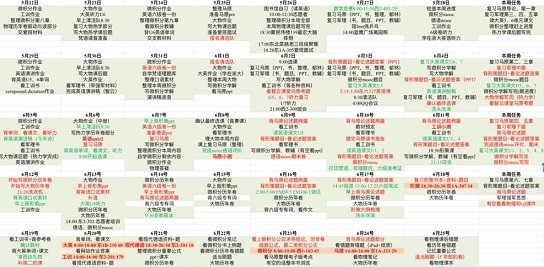
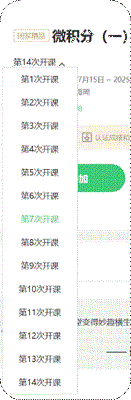

## 22级

=== "不是山谷 电气工程及其自动化"

    **解码微积分：电气工程的智识跃升**

    大学阶段，学习不仅仅是完成任务，更是一种自我成长的探索，学习的过程有时让人迷茫，有时也会让人沮丧，但每一次的坚持都在积累力量，它为未来的每一步打下基础。比尔盖茨曾说：“成功的过程中，有时候并不意味着一定会有结果。”学习也是如此，是一场与自己的较量，重要的不是一时的结果，而是不断尝试、不断进步的过程。

    进入大学，我们首先得正确理解中学阶段老师们曾经灌输的“到了大学就解放了”的观念。“解放”并不意味着大学不用学习，而应是更加自主、自由的学习。大学阶段没有人会去逼着你学习，抓着你的成绩不放（除非挂科了），所以我们需要自主规划学习任务，平衡学业与课余活动。

    人生的道路不是笔直的，它是一连串转弯和偶然，大学里的每一次学习经历，都是独一无二的积累，它不仅为当下服务，更会在未来绽放出光芒。在这篇文章中，我将以课程微积分（甲）Ⅰ的学习经历为例，分享我的学习经验，帮助同学们在学业上实现进步与提升。

    **一、打好基础：构建微积分的知识框架**

    **1. 高效预习**

    我会在周末预习下周课堂上要讲的内容，预习的方式主要是浏览课本，目的是对公式有个大致的印象。浏览课本时重点关注以下三个内容：公式是由什么实际问题引出的（可能的应用场合）、公式在例题里是如何运用的、有没有什么很巧妙的算法（你觉得自己想不到的算法）。看不明白的地方还要做好标注，上课时重点听老师讲解，还可以当面请教老师。

    **2. 及时复习**

    像微积分这样的基础课，很多概念是连续性的，一旦漏掉了一节课的内容，后续理解就会变得困难。因此每周末我会对本周学习的知识进行梳理，根据ppt和课本理清脉络，确保能够将公式默出、能够不参考解题过程求解课本例题。此外，周末我还会抽出一部分时间学习课外教辅的对应章节，接触更多不同的题型和解题思路。

    **二、挑战与超越：从失败中找到突破口**

    **1. 分析问题、专项突破**

    第一次微积分小测成绩并不理想，这让我意识到自己的学习方法可能存在问题。在此之前，我的学习方式多为理解课本概念，以一种类似学历史的方式做笔记、记公式。然而这种方法仅让我停留在了公式理解层面，并不能熟练运用公式解题，思维也不够灵活。在与助教交流后，我重新调整心态与学习方式，省去了大量美化笔记的时间，只记录关键性的推导步骤以及公式，腾出时间来做练习题。

    **2. 时间管理**

    大学的教学进度非常快，一周下来的任务量可能会非常重。 
    
     

    第一学期我的学分高达31.5，课业任务重，因此时间规划就显得非常重要。我习惯使用wps的表格来安排自己的任务，会在前一周的周末安排好下一周每一天的任务以及本周需要完成的任务，特别重要的任务会用红色字体和橙色填充标注，重要的任务会用红色标注，相对次要的会用绿色标注，完成后会用绿色的填充色填掉每一个框。我习惯用这种每周的形式而非每日的todolist来安排，这样当天的任务完成后如果时间还有空余也不至于无所事事，可以进一步完成明日的任务。

    **三、学习工具箱：高效掌握微积分的关键助力**

    学习微积分的过程中，除了教材和课堂讲解，合理利用一切可利用的资源也极为关键。以下是我在学习中常用的资源：

    **1. 在线课程**

    我在课后经常参考中国大学MOOC平台上苏德矿教授的微积分课程。谁也无法保证三节连堂课都能做到全神贯注地听讲，那么在那些走神的部分就需要及时通过智云或者MOOC补上。我的任课老师是朱静芬老师，在课后额外再听苏德矿教授的网课有时能获得第二种解题思路，拓宽思维。

    MOOC平台上还有课后练习和期末考试题，这些题目和平时小测的题型很像，建议大家都要认真独立地做过。如果希望在做完之后查看答案，可以尝试搜索前几年开设地同名称课程，比如2020年或2021年开设的这门课，这些课程由于已经过了评分阶段，其中的题目可以无限制的反复练习，做完提交后还会显示正确答案。

    **2. 教辅书籍**

    
    
    除了教材，我还会参考高等教育出版社《数学分析》。由于面向工科生的微积分课程更侧重实际应用，所以有些复杂公式的推导过程并不会详细地讲，而《数学分析》这本书中就会有详细的介绍，在学有余力的时候可以熟悉一下公式的推导过程，锻炼逻辑思维的同时也加深了对公式的记忆。

    学校图书馆也有很多使用的教辅。打开浙大钉，依次点击“工作台”-“图书馆”-“馆藏查询”即可搜寻想要的书籍。比比如我们可搜索“微积分”“数学分析”“微积分习题解答”等关键词，再观察一下每本书的目录是否与课程内容匹配，就可以找到合适的教辅、习题册。

    **3. 老师、助教、同学**

    至今仍记得当时微积分助教说的一句话：“一个人，可以走的快；一群人，才能走得远。”

    在学习过程中遇到困惑一定要及时与助教和老师交流讨论。平时我遇到有疑惑的点会先标注出来便于下次翻找，周末会抽时间整理这周标注出来的问题，这时候有些问题已经能够自己解决了，剩下来那些仍然存疑的就要去询问老师、助教或者同学。

    我们班级组织了“每日两题”的学习活动。每天早上9：00会由一位同学发布两道微积分（或者线性代数）的高质量、难度较高的题目，下午17：00公布答案。班级其他同学可以独立做题或者在班级群内讨论，由此我们班形成了浓厚的数学学习氛围，同学之间的讨论拓宽了大家的思维，每天练习题目也保持了题感。

    **4. 其他资源**

    每学期开学前，我会先搜集下学期每门课程可能用到的学习资料。搜索的平台主要包括cc98论坛、朵朵校友圈、公众号、学长学姐传承的资源、学解.......

    这里汇总了一些获取学习资源的方式：

    * cc98学习资源汇总楼[【2021年版】](https://www.cc98.org/topic/5025877)
    * 朵朵直接搜索课程关键字、“菜菜的学习资源帖”
    * 公众号：“郁林”“一起学习德智体”“SLOFFDE”“学解”
    * 向学长学姐求资料
    * 学解[电子版资料](https://pan.zju.edu.cn/share/4a24281533a9dcbccae1328226)

    **四、精准刷题法：考前复习的有效策略**

    **1. 预留复习时间**

    第一学期期中考试前，我预留了1周的复习时间，但最后发现时间安排得过少，导致考出来的分数也不太理想。因此我在期末考前将复习时间调整为一个月，最后的复习效果大大提升。所以如果想要稳稳地在每一门课上都拿到高分，我的建议是预留出一个月的时间开始复习备考，合理安排好每一天的复习任务。

    **2. 利用题目复习**

    复习时我主要参考的是课本的例题和历年卷（来自学解）的题目。课本例题选取的都是一些经典题目，难度也不是很大，可以反复看解题过程，理解解题思路，在考试的时候遇到类似的题目可以尝试用同样的思路去求解。历年卷主要是用于熟悉考试题型，模拟一下时间分配。刷历年卷在于“质”而不在于“量”，前几年的考试据说会出到和历年卷一样的题目，因此同学们都在大量的背题，但近些年已经改革，背题将不再可行。当有题目做不出来时，我会重新回到课本，把与之相关的知识点再重新过一遍，这样同类型的考点都能得到巩固，而不是仅仅局限于把这道题目弄懂。

    **五、写在最后**

    在学习的路上，最令人沮丧的时刻莫过于努力付出后却看不到收获。当我们遇到这样的瓶颈时，不要轻易否定自己，而是要冷静反思：我的努力是否真的有效？是否有更好的学习方法？这个时候，不妨向学长学姐请教，他们可能已经走过了你现在正经历的弯路。找到适合自己的学习方法，最重要的是，坚持下去。只有不断积累和调整，才能迎来真正的突破。

    大学是一个资源丰富的地方，机会永远属于那些积极争取的人。很多机会不是等来的，而是靠自己问出来的。无论是学术问题、学习资料，还是个人发展，多向周围的同学、老师请教，勇敢发问，积极争取。每一次主动探索，都会让你离目标更近一步。

    最后，愿每个人都能如星辰般闪耀——在天璀璨，在地从容。学习是一场持久战，愿你我都能在这条路上收获属于自己的光辉，担得起倾慕仰望，经得住黯淡平凡。