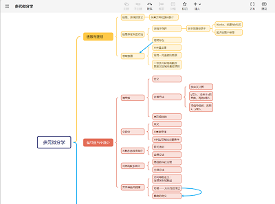

## 22级

=== "Puff 电子信息工程"

    **一、从迷茫走向坚定**
    
    又到了新生开学的日子，偶尔在路上路过几位刚进校园的新生们，看到他们脸上挂着热情洋溢的笑容，自己心中也不由得高兴了几分。我回想起自己刚进校园的那段时光，那是充满了好奇与兴奋，但又同时很迷茫的日子。之前有朋友跟我说，“大学不像高中那样，高中很纯粹，大家都只有学习这一个共同目标，而在大学要考虑的就很多了”。是啊，当时刚入校园的我，就被大学里五花八门的事情吸引着，好奇兴奋地接受着新事物冲击的同时，也是对未来的去向感到十分迷茫。
    
    因此，我也想从一个过来人的视角，给刚来的学弟学妹们提供一些帮助，希望能对你们有所启发，从迷茫中看到未来要坚定的方向。正如我刚刚所说的，刚入校园的大家想必都被许多新事物所吸引着，比如你可能会想：那有个学生组织在纳新，我要不要试试来锻炼自己的工作能力？百团大战有好多有趣的社团，我要不要参加几个去玩玩？甚至少了高中老师的管教，你有可能整天窝在寝室里打游戏，连课都不去上饭都不去吃，整日与游戏和泡面作伴。但是请注意，“大学”二字，终归是有“学”这个字眼，所以不要忘记你来大学的首要目的——学习。在学习好的基础上，再去见识新事物、拓展新能力，这才是一个合格的大学生该做的。因此，我也将从我自身的经历，来讲讲自己的学习经验，自己如何高效率地学习，仅供学弟学妹们参考。
    
    **二、一些有效的学习方法**
    
    首先来讲一些普适性的学习方法吧，对各个课程都有效的方法。
    
    **1. 提高上课效率**
    
    这一点是我认为最重要也是对自己提高学习效率最有用的一个方法。在我身边不乏这样的同学：上课来了但并不认真听讲，时常刷刷手机或者做别的事情了。甚至可能连课都不来，叫同学在有签到的时候提醒他一下。这样的同学往往是在课下花费更多的时间与精力，去搞明白上课老师讲的内容。但是这样一来，不仅课上的时间浪费了，课下也得比上课认真听的同学们花费更多的时间在学习上。甚至有可能，你对着枯燥乏味、不会主动发声给你讲明白这个知识点到底是怎么回事的课本，理解得也不是很透彻、很到位，可能远不如在课上老师给你的一两句点拨。
    
    因此，我的想法很简单，提高课上的效率，争取在课上就把老师所讲的内容都消化好，这样课下就能够减少很多负担。所以，在上重要的课时，我都会坐在第一排，认真听老师的讲解，将手机搁置一旁不会翻看。这样，许多我在课上就搞明白的知识，一些课上不认真的同学可能需要在课下反复翻看课本才想明白，或者反复翻看课本还不理解，来问我才搞明白。
    
    **2. 课前预习**
    
    这个习惯其实更多地也是为第一点服务。一些比较晦涩难懂的知识点，如果你课前进行了预习，大致知道了一些，那么你在课上理解将会更轻松，从而课上的效率也就提高了。因此，在大一时对于一些重要的基础课程，我都会在课前的一两天去预习一下新的知识，预估一下老师大概会讲到哪里，然后把这一部分知识仔细看看。而预习的方式也很多样化，你可以去看课本，或者如果老师提前有提供课件什么的在学在浙大或钉钉上，你也可以去参考参考。
    
    上面两点是较为普遍的一些学习方法，那下面我就针对微积分（甲）Ⅱ这门课来讲讲自己对于这门课的一些学习方法。
    
    **3. 绘制思维导图**
    
    微甲Ⅱ相较于微甲Ⅰ，个人感觉在内容上翻了一倍，而且也比微甲Ⅰ更加抽象、更加晦涩难懂了。所以当时的我总是有种学得云里雾里、不明不白的感觉。
    
    因此，我当时就采用做思维导图的方式，来让自己梳理一下微甲Ⅱ所学的知识内容。这里我向大家推荐一款做思维导图的软件，叫Xmind。
    
    
    
    如图是我之前学微甲Ⅱ时做的思维导图，当时我把多元微分学这块的知识点都整理了一下，就很快能让自己更清楚地了解到这部分内容我学了哪些知识，哪些题型该用什么知识去应对，对自己期末复习的时候也有很大的帮助。个人感觉这个软件比较容易上手，而且做出来的思维导图也很清晰，所以还是挺推荐各位学弟学妹们使用的。
    
    **4. 多看课本**
    
    对于微积分这门课，我感觉课本编写得都还是很不错的。所以，我当时课下就经常翻课本，看课本上关于知识的讲解，以及课本上提供的相应的例题，这些都对我理解知识有很大的帮助。通过看课本，有时我可以更好地理解老师上课讲的内容，有时也可以关注到老师上课可能忽略掉的一些知识或方法，感觉收获还是很大的。而且，大学不像高中，大学的知识点比高中要多很多，但考试的话就只会出课本上相关的知识点。因此，把整本书理解到位了，应对考试还是比较轻松的，这点我感觉跟高中很不一样。
    
    **三、一些学习资源**
    
    刚刚所讲的，是关于学习上的一些方法。那在这一块，我就会介绍一些有用的学习资源。
    
    **1. 不要害怕去问**
    
    其实最直接的方式就是去问老师、问助教或者问同学。当你遇到不理解的知识点，或者不会做的题目，你都可以去问别人，或是线下去问老师，或是钉钉上问助教，亦或是找同学问。通过交流，你可能就会很快理解对应的知识点，但如果你不敢去问，那可能你需要一个人琢磨很久，甚至可能最后放弃说算了，这个知识点不理解也罢。
    
    **2. 一些资料**
    
    对于微积分这门课程，我很推荐的一个公众号是“路老师的nonsense collection”。这个公众号是一位微积分助教老师开设的，里面有很多关于微积分的资料，也有课本上的习题解答供大家参考。当然，我很不建议大家把习题解答直接拿来抄，只有当自己不会做的时候去看看，这样才会有更大的帮助。另外还有一个公众号大家也可以参考参考，就是卢兴江老师的公众号“卢兴江带你学习微积分”。个人感觉卢老师的这个公众号的内容，更多地面向的还是基础比较好的同学，里面的内容还是比较拔高的。
    
    另外还有就是“善用搜索”。这是到了大学几乎每位同学必须学会的技能，平时可以多用朵朵、98来搜索资料，上面也有很多前辈会在上完课后提供一些资料、以及课程的感想的。这些都会对大家有所帮助。
    
    **四、学会规划**
    
    除了学习方法、学习资源以外，还有一个很重要的就是要学会规划自己的日常。这里我会从短期规划和长期规划两方面给大家介绍我当时的一些经验。
    
    **1. 短期规划**
    
    其实我当时的短期规划，就是在规定时间内把老师上课讲的知识点消化好就可以了。具体来说，就是我要求自己必须在老师下一次上课前，找时间把上节课所学的内容弄明白（如果有课上没听懂的知识点），这样就不至于影响下一次课上的学习。如果不将上次课内容都弄明白，那下次课可能就会使自己更加听不懂，从而像滚雪球一般，自己的漏洞越来越多，积累到最后可能就不想学了。因此，我就要求自己必须及时把学的内容消化好。其实这样一来，到学期末的时候，你也会发现复习起来很轻松，因为没有自己之前落下或者不会的知识点，只需再巩固一下之前学的知识即可。
    
    **2. 长期规划**
    
    这里的长期规划，就是指对于整个学期的学习进行规划。对于微甲Ⅱ这门课程，其实还是有很多小测的，也会有期中考，微甲Ⅰ也是。因此，关注小测的具体时间是很有必要的，你可以在小测之前去好好规划一下，腾出一块时间来复习所学的知识，还是很有帮助的。另外就是期中考，其实期中考之前的复习也是非常有必要的，因为在浙大期中考是不会特意腾出时间停课给你复习的。因此，往往是课一上完秋八周冬一周就会期中考，如果考试密集的话，你甚至不会有复习的时间。因此及时规划出复习的时间，还是很有用的，不至于临时抱佛脚。
    
    再一个就是期末的总复习。这个我个人是推荐冬六周就开始复习的，因为如果到最后一周才开始复习，肯定是来不及的。另外，你也可以提前去查一查期末考试的具体安排，期末考试期间的复习也是很有效的。因为在大学，期末考试不像高中，两三天就考完了，而是“考试周”。在这一两周的时间内，还是会有很多空出来的时间的，而这些时间利用好的话，对考试还是能起到很有效的帮助的。
    
    **五、当时我遇到的困难**
    
    如之前所说，微甲Ⅱ相较于微甲Ⅰ，内容更多、知识更难懂。因此，在当时我也是遇到了不少的困难。比如，我无法很直观地理解多元微积分的内容，因为那是在平面、甚至三维上的函数。所以，我当时也是按照上面我提到的各种方法，来让自己更好地学习微甲Ⅱ这门课。我向助教老师请教各种问题，当时负责我们班的那位助教老师也很耐心，给我讲解了很多；我也向微积分学得比较好的学长求助，问他们当时的一些学习方法等等。再一个就是严格要求自己，在下次课前必须把上次课的内容弄明白，不然上课就跟不上了。虽然学得比较艰辛，但最后还是取得了比较不错的成绩。
    
    **六、关于刷题，我想说**
    
    对于临近考试周用刷题的方式来短期迅速提升自己的知识水平，这点我其实是挺不赞同的。很多同学在平时不认真学习，在临近期末的时候通过边刷题边理解知识点的方式来让自己迅速掌握知识，最后能让自己通过考试。但是，这种方式一方面让自己在期末的时候面临很大的焦虑和压力，而且也不能保证自己对所有知识点都能掌握，另一方面会使得自己在考完试之后，迅速将知识遗忘。这对自己的成长是很没有帮助的。
    
    因此，我觉得同学们最好还是注重平时，像我在上面所说的，在短期内不要有遗漏的知识点，在老师下次课前就把上次课内容完全消化好，及时查漏补缺，这样才能更好地应对期末考试。只有真的平时没有好好学，最后要面对考试时，刷题才可能是最有效的办法。
    
    而面临考试周时，个人建议如果有比较充裕的时间，还是多回顾课本，把课本的整体框架整理明白。因为考试时，所有出的题目的知识点，都是来自课本的。当你把课本的框架捋清楚，对应的知识点掌握好，考试肯定是没有问题的。而且这样的做法，也可以让自己更好地掌握这门课程。很多同学会抱怨，在学完一门课之后，不久就会把这门课学的内容都忘掉了。但如果你当时学的时候是把课本的整体框架搞明白了，这门课程的整体逻辑掌握住了，那么这个框架你是很难忘记的。至于细小的知识点，即便是被遗忘了，那在你有这个框架之后，是很快就能回顾起来的。这对我们未来的成长也是大有裨益的。
    
    **七、最后的小建议**
    
    最后我想给同学们说，学习并不是唯一的。我刚刚所说的这些学习经验，是为了让同学们更快地融入大学生活，更有效率地去学习。固然，学习是最基本最重要的东西，但除了学习以外，还是有很多其他的方面待同学们去发掘、去体验。毕竟，我们浙江大学，对我们的培养目标就是“德智体美劳全面发展、具有全球竞争力的高素质创新人才和领导者”嘛。所以，在有优异的成绩之外，同学们还得多去拓展自己的边界，力争做一个堪当民族复兴大任的杰出人才。